# Lab1web
## Membuat Halaman Web Dasar HTML
1. Memasukkan Title pada bagian HTML
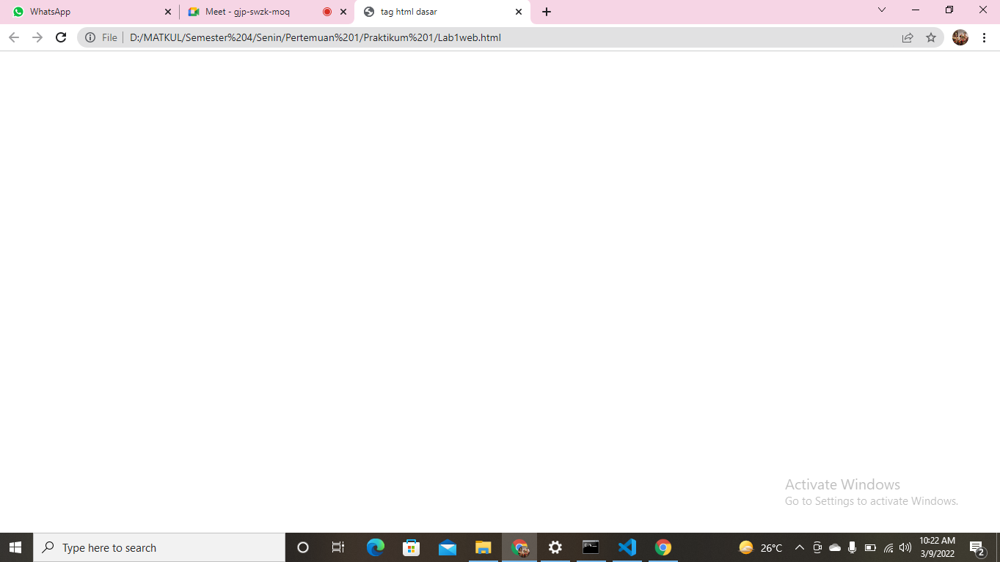
* Maka akan menampilkan gambar seperti berikut
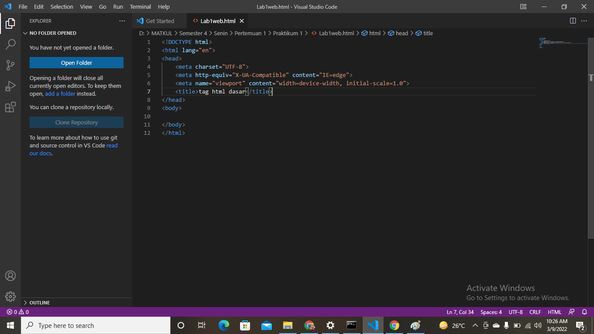
2. Ini adalah hasil pembuatan paragraf
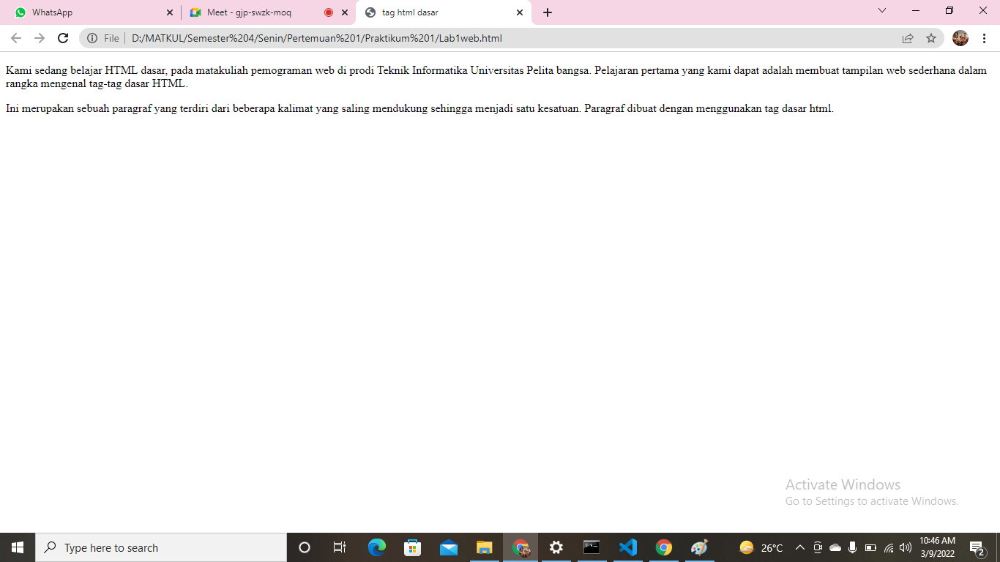
* Proses membuat paragraf sederhana
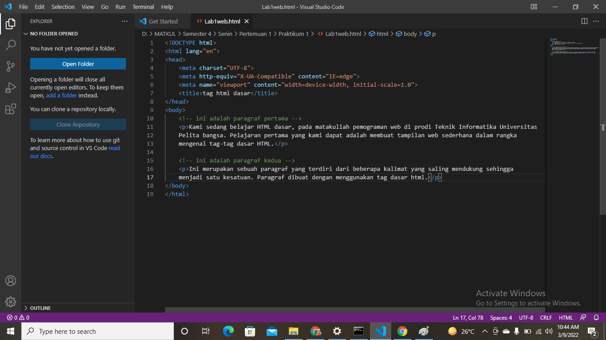
3. Perubahan atribut paragraf pertama dengan align = center & paragraf kedua dengan align = right
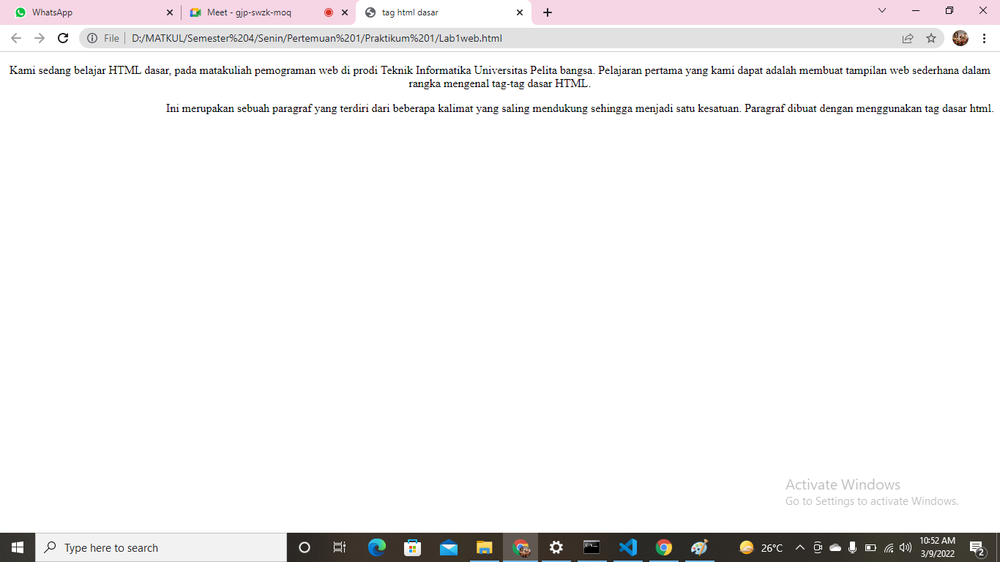
* Pengaturan atribut paragraf
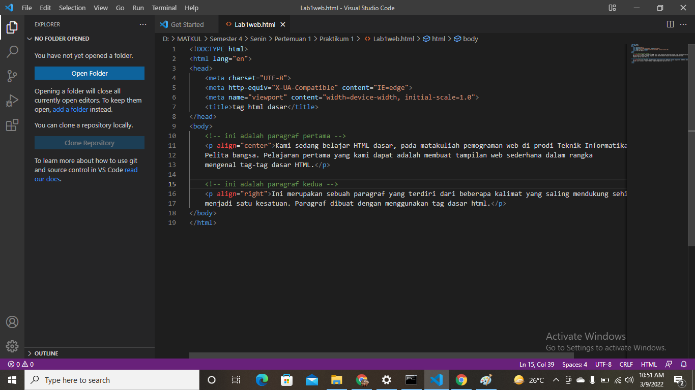
4. Menambahkan Judul
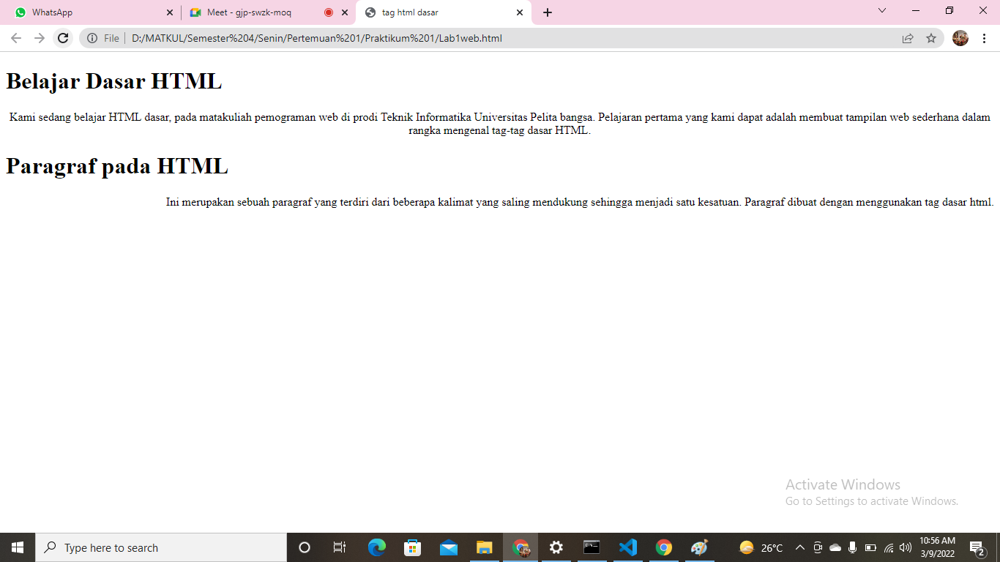
* Proses penambahan judul pada paragraf pertama & kedua
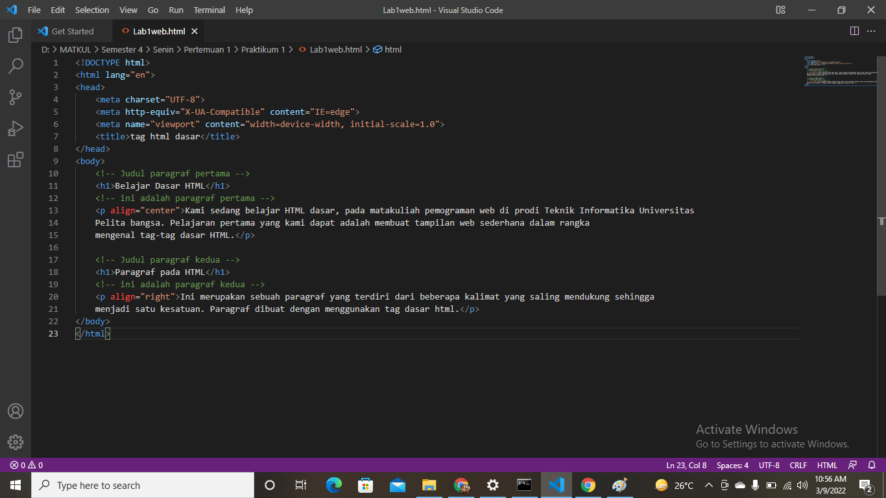
5. Memformat Teks yang ada pada paragraf
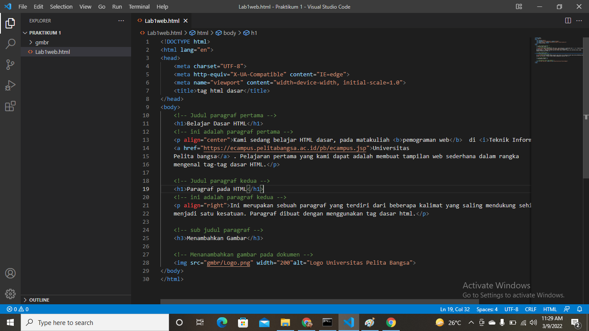
* Maka teks pada paragraf akan menampilkan perubahan seperti gambar berikut
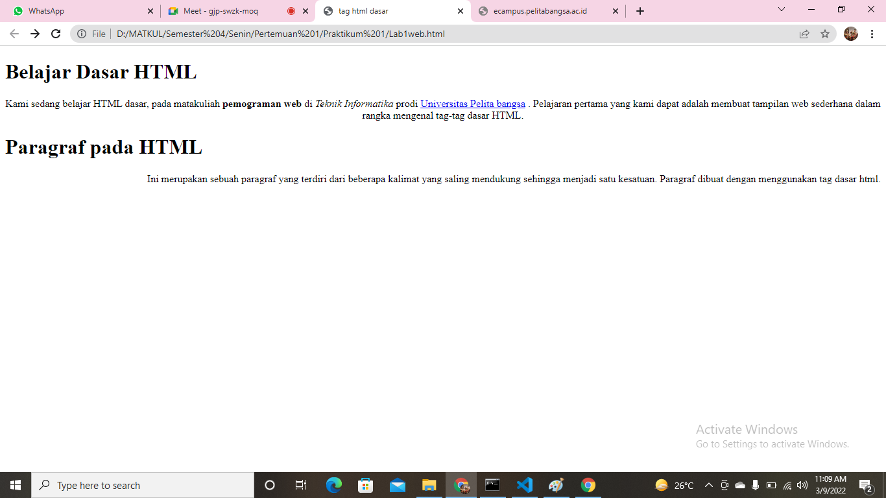
6.Menyisipkan Gambar
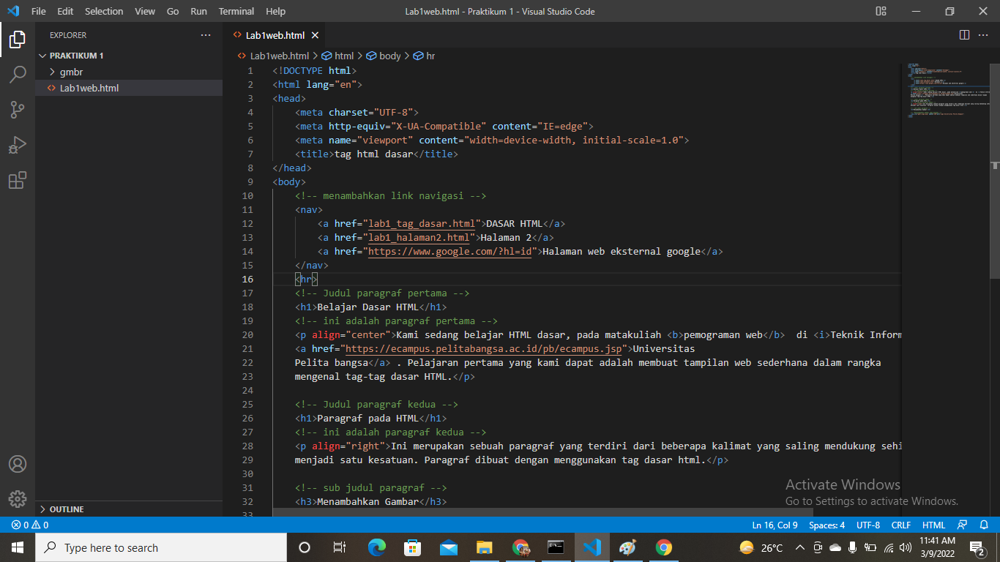
* Hasil dari menambahkan gambar dan sudah diatur sebagaimana gambar berikut
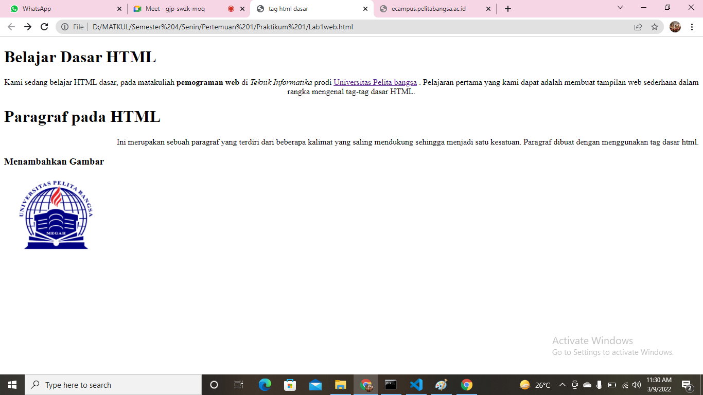
7. Hasil Penambahan Hyperlink
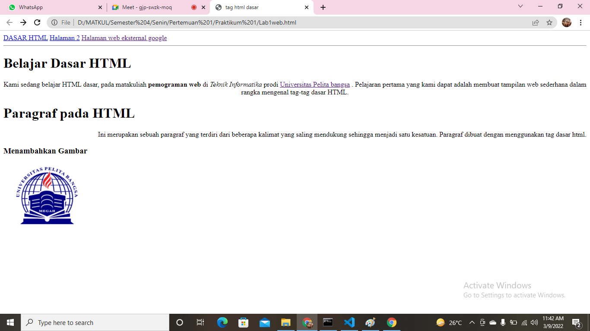
* Menambahkan Hyperlink pada Dokumen
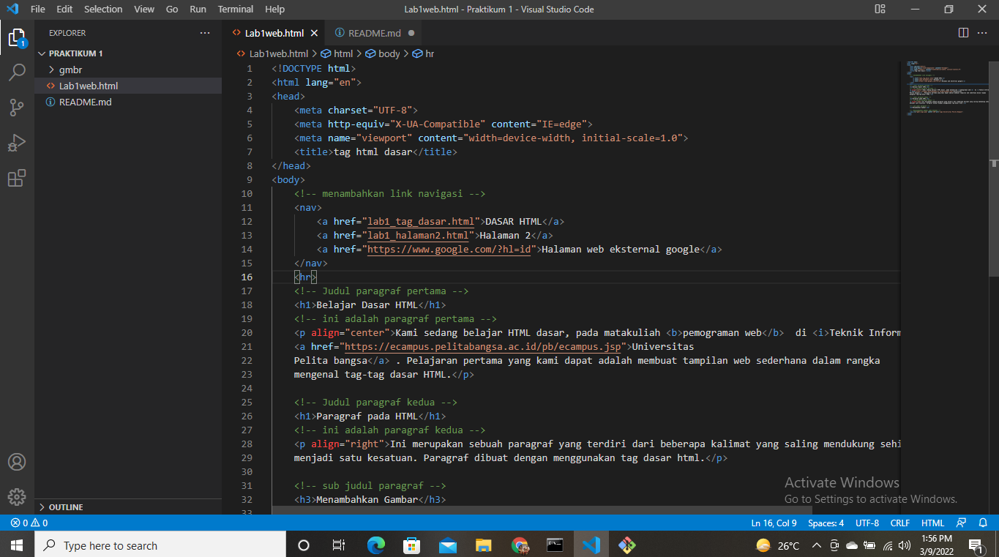
